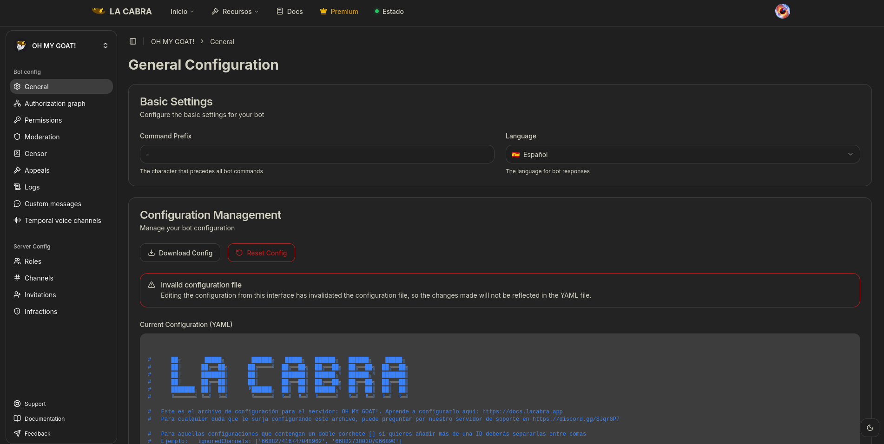

import { Aside, Card, CardGrid, LinkButton } from '@astrojs/starlight/components';

La Cabra tiene dos formas principales en las que puede ser configurada: mediante la dashboard web o mediante un archivo de configuración.

<CardGrid>

    <Card title="Dashboard" icon="desktop">
        La dashboard web es la forma más sencilla de configurar La Cabra. Permite cambiar todos los ajustes de manera visual y sin necesidad de conocimientos técnicos.
        Es la opción más cómoda para dispositivos móviles.
    </Card>

    <Card title="Archivo YAML" icon="document">
        El archivo de configuración es un archivo YAML que contiene todos los ajustes de La Cabra. Permite una configuración más avanzada y detallada,
        pero requiere conocimientos técnicos para su edición.
    </Card>

</CardGrid>

Ambas opciones dan la misma flexibilidad y opciones para la configuración, por la que la elección de una u otra es meramente personal.
No obstante, recomendamos encarecidamente ceñirse a la forma elegida, pues no son compatibles entre sí; una vez cambias un ajuste en la dashboard,
el archivo de configuración queda desactualizado. A continuación se explican conceptos importantes sobre ambos métodos.

## Sobre la dashboard

Puedes acceder a la dashboard de La Cabra pulsando en el siguiente botón:

<LinkButton href="https://www.lacabra.app/dashboard" icon="external" iconPlacement="start">Dashboard</LinkButton>

Usarla es muy sencillo, pues la mayoría de ajustes son autoexplicativos. No obstante, si hay algún ajuste que no quede claro, lo más probable es que esté
explicado en esta documentación.

Cuando seleccionas el servidor que quieres configurar, aparecerá un panel como el que se muestra en la imagen.



En la columna izquierda se encuentran los diferentes módulos de La Cabra, y al pulsar en uno de ellos, se mostrarán los ajustes disponibles para ese módulo.
Al cambiar algún ajuste, saldrá en la parte inferior un botón para guardar los cambios. Es importante pulsar ese botón para que los cambios se apliquen.

<Aside type="tip">
    Aunque vayas a usar la dashboard, es recomendable leer toda la documentación para saber a nivel conceptual qué hace cada módulo y ajuste.
</Aside>

## Sobre el archivo de configuración

Un archivo de configuración es un archivo YAML que contiene todos los ajustes de La Cabra. Permite guardar copias de seguridad de la configuración y puede ser más
rápido de configurar si se tiene experiencia con este tipo de archivos. No obstante, es más fácil cometer errores al editarlo,
por lo que se recomienda usar la dashboard si no se tiene experiencia. Para ello, se puede usar un editor de texto con resaltado de sintaxis para YAML,
como Visual Studio Code o una herramienta online como https://onlineyamltools.com/edit-yaml.

La configuración de La Cabra es un archivo de formato YAML, el nombre del archivo es la ID de tu servidor.
Este es un ejemplo de configuración muy básico:

```yaml
prefix: '/'
commands:
  'ban': 20
  'borrar': 10
  'clear': 10
```

El bot se divide en módulos, los cuales necesitas declarar en la configuración para que funcionen. Cada uno de esos módulos son los listados en los diferentes
apartados de esta documentación.

Si decides que vas a configurar La Cabra mediante el archivo de configuración, puedes obtener la configuración de tu servidor con el comando `/exportar` si eres el dueño,
o mediante el comando `/iniciar` si eres un administrador. Cuando obtengas tu archivo de configuración será algo parecido a esto, pero más extenso:

```yaml
lang: 'es-ES'      # El idioma del bot, por defecto es 'es-ES' (Español de España), puede ver la lista de idiomas disponibles en https://docs.lacabra.app/langs
prefix: '-'        # El prefijo de los comandos (por mensaje) del bot, por defecto es '-' (puedes cambiarlo a tu gusto)

authorizations:
    '163405286722371584': 100

# ... ( resto de configuraciones)
```


