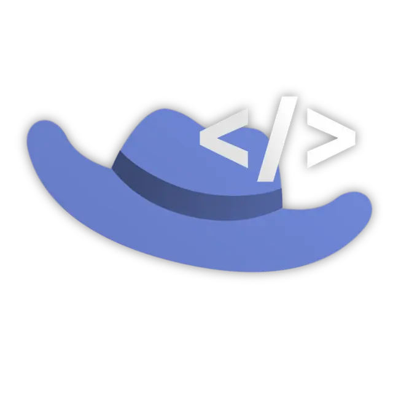
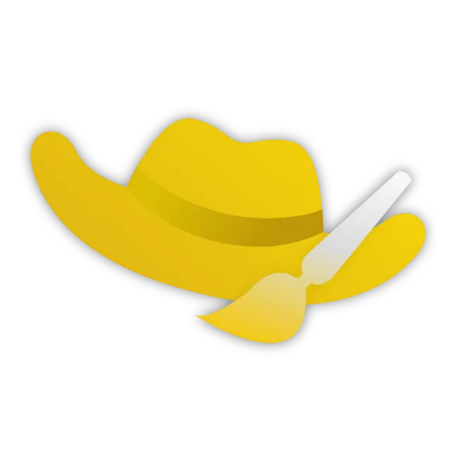

import { Card, CardGrid } from '@astrojs/starlight/components';

Las **badges** (o insignias) son reconocimientos especiales que se otorgan a ciertos usuarios de La Cabra por su contribución, apoyo o rol dentro del proyecto. Estas insignias son visibles al utilizar el comando `/info` (o `/badges`) sobre el perfil de un usuario.

A continuación, se detallan todas las badges existentes y lo que significan:

<CardGrid stagger>
  <Card title="Donador" icon="star">
    
     
    Badge exclusiva para quienes han aportado su granito de arena donando una cantidad al bot. 
  </Card>

  <Card title="Tester" icon="approve-check">
    
     
    Otorgada a los miembros del equipo de Testers por participar activamente reportando fallos y sugerencias.
  </Card>

  <Card title="Soporte" icon="information">
    
     
    Exclusiva para aquellos usuarios que forman parte del equipo de Soporte de La Cabra.
  </Card>

  <Card title="Desarrollador" icon="laptop">
    
     
    La tienen únicamente aquellos que trabajan de forma directa programando y desarrollando el bot.
  </Card>

  <Card title="Diseñador" icon="pencil">
    
     
    Corresponde a los encargados de la imagen, las ilustraciones y el diseño general de La Cabra.
  </Card>
</CardGrid>
